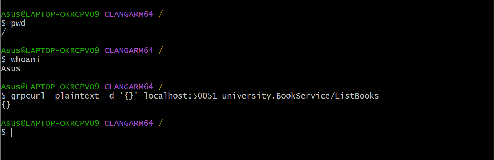
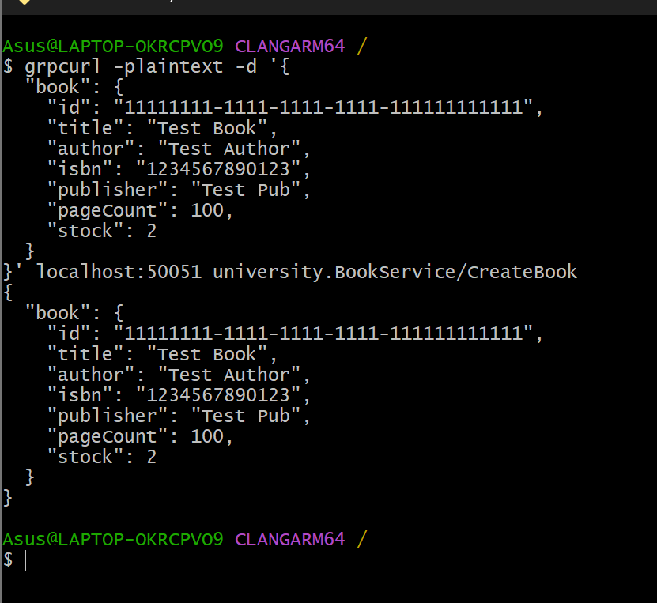
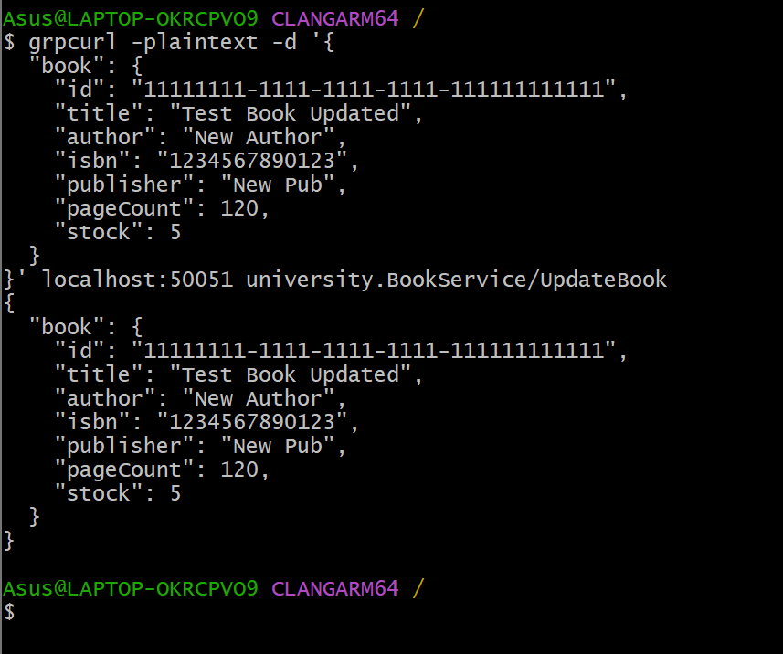
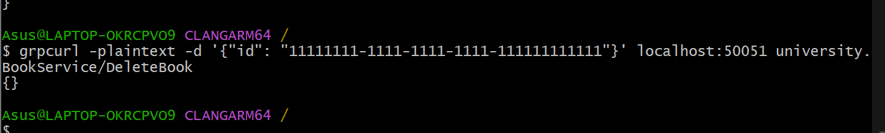
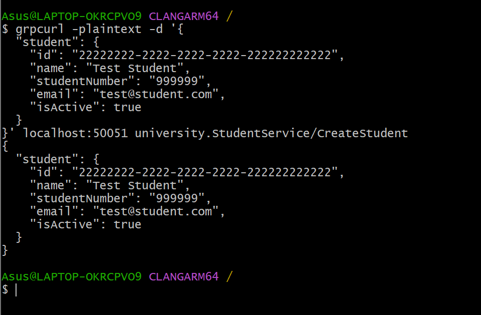
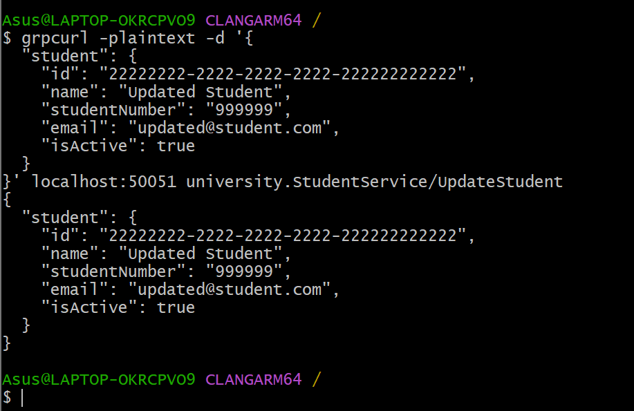
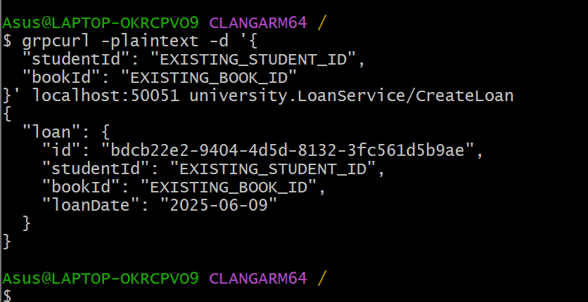
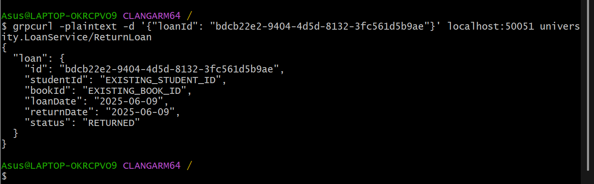

### 📘 BookService Testleri

# 🔍 Tüm kitapları listele
grpcurl -plaintext -d '{}' localhost:50051 university.BookService/ListBooks

# ➕ Yeni kitap ekle (örnek UUID)
grpcurl -plaintext -d '{
  "book": {
    "id": "11111111-1111-1111-1111-111111111111",
    "title": "Test Book",
    "author": "Test Author",
    "isbn": "1234567890123",
    "publisher": "Test Pub",
    "pageCount": 100,
    "stock": 2
  }
}' localhost:50051 university.BookService/CreateBook

# ✏️ Kitap güncelle (aynı ID ile)
grpcurl -plaintext -d '{
  "book": {
    "id": "11111111-1111-1111-1111-111111111111",
    "title": "Test Book Updated",
    "author": "New Author",
    "isbn": "1234567890123",
    "publisher": "New Pub",
    "pageCount": 120,
    "stock": 5
  }
}' localhost:50051 university.BookService/UpdateBook

# ❌ Kitap sil
grpcurl -plaintext -d '{"id": "11111111-1111-1111-1111-111111111111"}' localhost:50051 university.BookService/DeleteBook

### 👤 StudentService Testleri

# 🔍 Tüm öğrencileri listele
grpcurl -plaintext -d '{}' localhost:50051 university.StudentService/ListStudents

# ➕ Yeni öğrenci ekle
grpcurl -plaintext -d '{
  "student": {
    "id": "22222222-2222-2222-2222-222222222222",
    "name": "Test Student",
    "studentNumber": "999999",
    "email": "test@student.com",
    "isActive": true
  }
}' localhost:50051 university.StudentService/CreateStudent

# ✏️ Öğrenci güncelle
grpcurl -plaintext -d '{
  "student": {
    "id": "22222222-2222-2222-2222-222222222222",
    "name": "Updated Student",
    "studentNumber": "999999",
    "email": "updated@student.com",
    "isActive": true
  }
}' localhost:50051 university.StudentService/UpdateStudent

# ❌ Öğrenci sil
grpcurl -plaintext -d '{"id": "22222222-2222-2222-2222-222222222222"}' localhost:50051 university.StudentService/DeleteStudent

### 🔄 LoanService Testleri

# 🔁 Loan oluştur
grpcurl -plaintext -d '{
  "studentId": "EXISTING_STUDENT_ID",
  "bookId": "EXISTING_BOOK_ID"
}' localhost:50051 university.LoanService/CreateLoan

# 📄 Loan iade et
grpcurl -plaintext -d '{"loanId": "EXISTING_LOAN_ID"}' localhost:50051 university.LoanService/ReturnLoan

